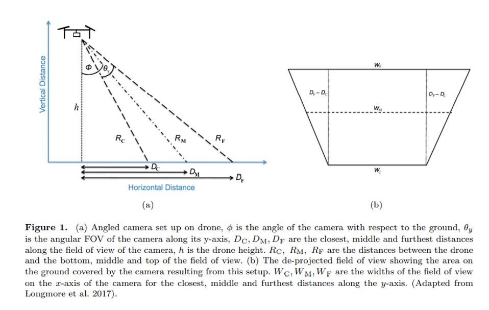

```{r setup, include=FALSE}
knitr::opts_chunk$set(echo = TRUE)
```

```{r klippy, echo=FALSE, include=TRUE}
klippy::klippy()
```


```{r, message=FALSE, warning=FALSE}
library(tidyverse)
library(Kulan)
library(data.table)
deg2rad=function(d){
  rad=d*pi/180
  return(rad)
}

```

For this example the altitude of the drone is 245m, the angle of the camera is 25 degrees

```{r}
h=245
# angle of camera
# 25 degrees
theta <- deg2rad(25)
# horizontal field of view
phi <- deg2rad(54.30)
# vertical field of view
omega <- deg2rad(37.84)
```

From Burke et al.'s Appendix (and Figure 1 shown below) we can calculate the horizontal distance and the camera projection. 

$\theta$ is the angle that the camera is set at (in our case on one side of the drone =25 degrees)

$\phi$ is the vertical field of view 


We can use pythagoras theorem to get the values for Dc, Dm and Df. 

```{r}
Dc= h*tan(theta-phi/2)
Df= h*tan(theta+phi/2)
Dm= h*tan(theta+phi*0.5/2)
```
The horizontal distance visible to the camera is Df-Dc which in our case is `r round(Df-Dc)`. 

The distance from the drone to the closest (c), median (m) and furthest distance (f) is denoted as R in the figure and we can calculate this as follows:

```{r}
Rc=sqrt(h^2+Dc^2)
Rm=sqrt(h^2+Dm^2)
Rf=sqrt(h^2+Df^2)
```

Rc=`r Rc`

Rm=`r Rm`

Rf=`r Rf`

Here is a schematic plot of our data to attempt to match Figure 1a. 

```{r}
library(data.table)
dt.triangle <- data.table(group = c(1,1,1), polygon.x = c(0,Dc,0), polygon.y = c(h,0,0))
dt.triangle2 <- data.table(group = c(1,1,1), polygon.x = c(0,Df,0), polygon.y = c(h,0,0))

p <- ggplot()
p <- p + geom_polygon(
  data = dt.triangle
  ,aes(
    x=polygon.x
    ,y=polygon.y
    ,group=group
  )
)
p+geom_polygon(
  data = dt.triangle2
  ,aes(
    x=polygon.x
    ,y=polygon.y
    ,group=group
    , alpha=0.2
  ))+
  labs(x="Horizontal distance", y="Vertical distance")+
  theme(legend.position = "None")

```

## Adding the other camera

In our case we have two cameras with different angles and we can plot these to show the images horizontal footprints.

```{r}
theta2 <- deg2rad(25.7)
Dc2= h*tan(theta2-phi/2)
Df2= h*tan(theta2+phi/2)
Dm2= h*tan(theta2+phi*0.5/2)

dt.triangle <- data.table(group = c(1,1,1), polygon.x = c(0,Dc,0), polygon.y = c(h,0,0))
dt.triangle2 <- data.table(group = c(1,1,1), polygon.x = c(0,Df,0), polygon.y = c(h,0,0))

dt.triangle3 <- data.table(group = c(2,2,2), polygon.x3 = c(0,-Dc2,0), polygon.y3 = c(h,0,0))
dt.triangle3 <- data.table(group = c(2,2,2), polygon.x3 = c(0,-Df2,0), polygon.y3 = c(h,0,0))


p <- ggplot()
p <- p + geom_polygon(
  data = dt.triangle
  ,aes(
    x=polygon.x
    ,y=polygon.y
    ,group=group
  )
)
p<-p+geom_polygon(
  data = dt.triangle2
  ,aes(
    x=polygon.x
    ,y=polygon.y
    ,group=group
    , alpha=0.2
  ))
p+geom_polygon(
  data = dt.triangle3
  ,aes(
    x=polygon.x3
    ,y=polygon.y3
    ,group=group
    , alpha=0.2
  ))+
  labs(x="Horizontal distance", y="Vertical distance")+
  theme(legend.position = "None")
```


## Projecting the camera to the trapezoid

To develop the trapezoid of the camera we need to look at Figure 1b. $\omega$ refers to the horizontal field of view. 

```{r}
Wc=2*(Dc^2+h^2)^0.5*tan(omega/2)
Wm=2*((Dc+Df/2)^2+h^2)^0.5*tan(omega/2)
Wf=2*(Df^2+h^2)^0.5*tan(omega/2)

```

Again we can attempt to recreate the image from Figure 1b

```{r}
positions <- data.frame(
 x = c(0, 0, Df-Dc, Df-Dc),
  y = c(-Wc/2, Wc/2, -Wf/2, Wf/2)
)
ggplot(positions[c(1,2,4,3),], aes(x = x, y = y)) +
  geom_polygon(aes(fill = "red"))+
  labs(x="", y="")+
  theme_classic()+
  theme(legend.position = "None")


```
